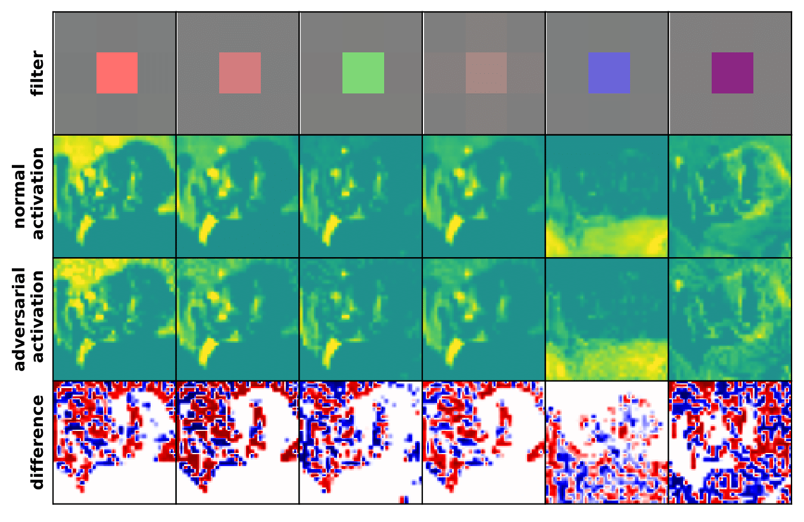

# Adversarial Robustness through the Lens of Convolutional Filters
Paul Gavrikov, Janis Keuper



Workshop Paper: TBD

Workshop Poster: TBD

Abstract: *Deep learning models are intrinsically sensitive to distribution shifts in the input data. In particular, small, barely perceivable perturbations to the input data can force models to make wrong predictions with high confidence. An common defense mechanism is regularization through adversarial training which injects worst-case perturbations back into training to strengthen the decision boundaries, and to reduce overfitting. In this context, we perform an investigation of $3\times 3$ convolution filters that form in adversarially-trained models. Filters are extracted from 71 public models of the $\ell_\infty$-RobustBench \textit{CIFAR-10/100} and \textit{ImageNet1k} leaderboard and compared to filters extracted from models built on the same architectures but trained without robust regularization. We observe that adversarially-robust models appear to form more diverse, less sparse, and more orthogonal convolution filters than their normal counterparts. The largest differences between robust and normal models are found in the deepest layers, and the very first convolution layer, which consistently and predominantly forms filters that can partially eliminate perturbations, irrespective of the architecture.*

## Citation 

If you find our work useful in your research, please consider citing:

```
COMING SOON
```

### Legal
This work is licensed under a
[Creative Commons Attribution-ShareAlike 4.0 International License][cc-by-sa].
