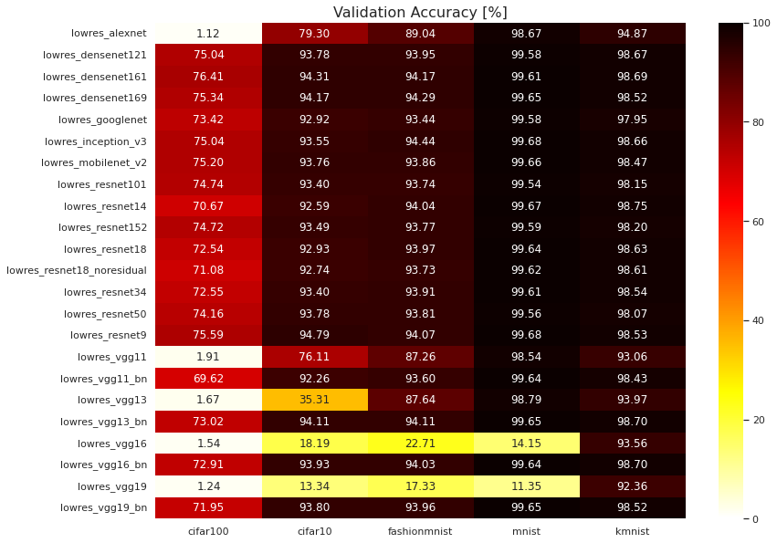
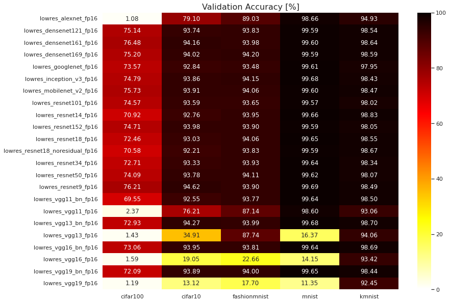

# pytorch-pretrained-cnns

## Reproduce training
```
python train.py --data_dir /data/datasets/ --classifier <Classifier Name> --dataset <Dataset Name> --batch_size 256 --gpu_id <GPU ID> --num_workers 8
```
## Checkpoints

https://mega.nz/folder/gxchzYyb#wrHGXqyw29fk8b6VI0Gfiw (only 32-bit)

# 32-bit precision (fp32, default)



## cifar10

| Model | Epoch | Train Loss | Train Accuracy | Validation Loss | Validation Accuracy |
|:---|---:|---:|---:|---:|---:|
| lowres_alexnet | 95 | 0.563 | 80.717 | 0.604 | 79.297 |
| lowres_densenet121 | 96 | 0.047 | 99.716 | 0.247 | 93.780 |
| lowres_densenet161 | 97 | 0.042 | 99.830 | 0.232 | 94.311 |
| lowres_densenet169 | 98 | 0.046 | 99.742 | 0.235 | 94.171 |
| lowres_googlenet | 97 | 0.064 | 99.651 | 0.242 | 92.919 |
| lowres_inception_v3 | 96 | 0.062 | 99.501 | 0.254 | 93.550 |
| lowres_mobilenet_v2 | 96 | 0.074 | 98.892 | 0.237 | 93.760 |
| lowres_resnet101 | 96 | 0.041 | 99.329 | 0.242 | 93.399 |
| lowres_resnet14 | 97 | 0.040 | 99.567 | 0.254 | 92.588 |
| lowres_resnet152 | 99 | 0.032 | 99.629 | 0.249 | 93.490 |
| lowres_resnet18 | 97 | 0.033 | 99.685 | 0.250 | 92.929 |
| lowres_resnet18_noresidual | 99 | 0.059 | 99.371 | 0.282 | 92.738 |
| lowres_resnet34 | 99 | 0.027 | 99.714 | 0.253 | 93.399 |
| lowres_resnet50 | 97 | 0.039 | 99.473 | 0.227 | 93.780 |
| lowres_resnet9 | 93 | 0.016 | 99.996 | 0.174 | 94.792 |
| lowres_vgg11 | 96 | 0.581 | 80.617 | 0.703 | 76.112 |
| lowres_vgg11_bn | 95 | 0.024 | 99.860 | 0.254 | 92.258 |
| lowres_vgg13 | 94 | 1.597 | 34.415 | 1.595 | 35.306 |
| lowres_vgg13_bn | 98 | 0.021 | 99.942 | 0.198 | 94.111 |
| lowres_vgg16 | 5 | 2.303 | 10.607 | 2.302 | 18.189 |
| lowres_vgg16_bn | 99 | 0.021 | 99.912 | 0.228 | 93.930 |
| lowres_vgg19 | 6 | 2.303 | 10.268 | 2.303 | 13.341 |
| lowres_vgg19_bn | 97 | 0.022 | 99.878 | 0.242 | 93.800 |

## cifar100

| Model | Epoch | Train Loss | Train Accuracy | Validation Loss | Validation Accuracy |
|:---|---:|---:|---:|---:|---:|
| lowres_alexnet | 4 | 4.605 | 0.919 | 4.605 | 1.122 |
| lowres_densenet121 | 94 | 0.192 | 98.678 | 1.082 | 75.040 |
| lowres_densenet161 | 98 | 0.171 | 99.373 | 1.044 | 76.412 |
| lowres_densenet169 | 97 | 0.177 | 99.171 | 1.063 | 75.341 |
| lowres_googlenet | 97 | 0.331 | 98.109 | 1.077 | 73.417 |
| lowres_inception_v3 | 97 | 0.276 | 98.395 | 1.055 | 75.040 |
| lowres_mobilenet_v2 | 93 | 0.342 | 94.940 | 1.009 | 75.200 |
| lowres_resnet101 | 95 | 0.133 | 98.596 | 1.070 | 74.740 |
| lowres_resnet14 | 98 | 0.380 | 93.321 | 1.110 | 70.673 |
| lowres_resnet152 | 97 | 0.127 | 98.846 | 1.059 | 74.720 |
| lowres_resnet18 | 98 | 0.163 | 98.257 | 1.103 | 72.536 |
| lowres_resnet18_noresidual | 98 | 0.309 | 96.020 | 1.196 | 71.084 |
| lowres_resnet34 | 97 | 0.103 | 99.165 | 1.161 | 72.546 |
| lowres_resnet50 | 96 | 0.131 | 98.834 | 1.062 | 74.159 |
| lowres_resnet9 | 91 | 0.075 | 99.806 | 1.000 | 75.591 |
| lowres_vgg11 | 9 | 4.605 | 0.976 | 4.605 | 1.913 |
| lowres_vgg11_bn | 98 | 0.095 | 99.303 | 1.307 | 69.621 |
| lowres_vgg13 | 8 | 4.605 | 1.016 | 4.605 | 1.673 |
| lowres_vgg13_bn | 94 | 0.088 | 99.393 | 1.158 | 73.017 |
| lowres_vgg16 | 6 | 4.605 | 0.968 | 4.605 | 1.542 |
| lowres_vgg16_bn | 96 | 0.110 | 98.702 | 1.267 | 72.907 |
| lowres_vgg19 | 2 | 4.605 | 0.958 | 4.605 | 1.242 |
| lowres_vgg19_bn | 96 | 0.136 | 97.917 | 1.349 | 71.945 |

## mnist

| Model | Epoch | Train Loss | Train Accuracy | Validation Loss | Validation Accuracy |
|:---|---:|---:|---:|---:|---:|
| lowres_alexnet | 86 | 0.053 | 98.444 | 0.045 | 98.668 |
| lowres_densenet121 | 92 | 0.035 | 99.980 | 0.044 | 99.579 |
| lowres_densenet161 | 93 | 0.035 | 99.983 | 0.043 | 99.609 |
| lowres_densenet169 | 96 | 0.036 | 99.977 | 0.042 | 99.649 |
| lowres_googlenet | 90 | 0.046 | 99.873 | 0.045 | 99.579 |
| lowres_inception_v3 | 98 | 0.046 | 99.873 | 0.041 | 99.679 |
| lowres_mobilenet_v2 | 96 | 0.035 | 99.983 | 0.042 | 99.659 |
| lowres_resnet101 | 87 | 0.020 | 99.978 | 0.032 | 99.539 |
| lowres_resnet14 | 80 | 0.021 | 99.985 | 0.030 | 99.669 |
| lowres_resnet152 | 94 | 0.019 | 99.990 | 0.030 | 99.589 |
| lowres_resnet18 | 83 | 0.020 | 99.993 | 0.030 | 99.639 |
| lowres_resnet18_noresidual | 84 | 0.034 | 99.988 | 0.041 | 99.619 |
| lowres_resnet34 | 79 | 0.019 | 99.977 | 0.029 | 99.609 |
| lowres_resnet50 | 86 | 0.020 | 99.982 | 0.032 | 99.559 |
| lowres_resnet9 | 83 | 0.006 | 99.998 | 0.016 | 99.679 |
| lowres_vgg11 | 75 | 0.051 | 98.589 | 0.053 | 98.538 |
| lowres_vgg11_bn | 75 | 0.017 | 99.995 | 0.027 | 99.639 |
| lowres_vgg13 | 80 | 0.026 | 99.344 | 0.046 | 98.788 |
| lowres_vgg13_bn | 90 | 0.017 | 99.998 | 0.026 | 99.649 |
| lowres_vgg16 | 0 | 2.302 | 10.383 | 2.302 | 14.153 |
| lowres_vgg16_bn | 90 | 0.017 | 99.992 | 0.026 | 99.639 |
| lowres_vgg19 | 0 | 2.303 | 11.116 | 2.302 | 11.348 |
| lowres_vgg19_bn | 85 | 0.017 | 99.988 | 0.027 | 99.649 |

## kmnist

| Model | Epoch | Train Loss | Train Accuracy | Validation Loss | Validation Accuracy |
|:---|---:|---:|---:|---:|---:|
| lowres_alexnet | 97 | 0.047 | 98.775 | 0.191 | 94.872 |
| lowres_densenet121 | 88 | 0.037 | 99.982 | 0.092 | 98.668 |
| lowres_densenet161 | 87 | 0.038 | 99.972 | 0.084 | 98.688 |
| lowres_densenet169 | 89 | 0.037 | 99.987 | 0.096 | 98.518 |
| lowres_googlenet | 97 | 0.044 | 99.970 | 0.112 | 97.947 |
| lowres_inception_v3 | 97 | 0.044 | 99.970 | 0.090 | 98.658 |
| lowres_mobilenet_v2 | 89 | 0.036 | 99.988 | 0.095 | 98.468 |
| lowres_resnet101 | 90 | 0.020 | 99.993 | 0.097 | 98.147 |
| lowres_resnet14 | 73 | 0.021 | 99.975 | 0.070 | 98.748 |
| lowres_resnet152 | 85 | 0.020 | 99.988 | 0.090 | 98.197 |
| lowres_resnet18 | 73 | 0.020 | 99.997 | 0.077 | 98.628 |
| lowres_resnet18_noresidual | 80 | 0.035 | 99.993 | 0.090 | 98.608 |
| lowres_resnet34 | 83 | 0.018 | 99.998 | 0.081 | 98.538 |
| lowres_resnet50 | 80 | 0.020 | 99.982 | 0.097 | 98.067 |
| lowres_resnet9 | 54 | 0.008 | 99.997 | 0.069 | 98.528 |
| lowres_vgg11 | 93 | 0.028 | 99.619 | 0.264 | 93.059 |
| lowres_vgg11_bn | 62 | 0.016 | 99.998 | 0.078 | 98.427 |
| lowres_vgg13 | 84 | 0.016 | 99.825 | 0.240 | 93.970 |
| lowres_vgg13_bn | 54 | 0.016 | 99.980 | 0.069 | 98.698 |
| lowres_vgg16 | 75 | 0.024 | 99.484 | 0.266 | 93.560 |
| lowres_vgg16_bn | 79 | 0.015 | 99.998 | 0.070 | 98.698 |
| lowres_vgg19 | 69 | 0.042 | 98.740 | 0.321 | 92.358 |
| lowres_vgg19_bn | 99 | 0.015 | 99.998 | 0.078 | 98.518 |

## fashionmnist

| Model | Epoch | Train Loss | Train Accuracy | Validation Loss | Validation Accuracy |
|:---|---:|---:|---:|---:|---:|
| lowres_alexnet | 97 | 0.296 | 89.248 | 0.308 | 89.042 |
| lowres_densenet121 | 92 | 0.037 | 99.947 | 0.266 | 93.950 |
| lowres_densenet161 | 93 | 0.038 | 99.937 | 0.264 | 94.171 |
| lowres_densenet169 | 97 | 0.038 | 99.933 | 0.258 | 94.291 |
| lowres_googlenet | 96 | 0.044 | 99.973 | 0.240 | 93.439 |
| lowres_inception_v3 | 97 | 0.050 | 99.861 | 0.244 | 94.441 |
| lowres_mobilenet_v2 | 98 | 0.040 | 99.913 | 0.252 | 93.860 |
| lowres_resnet101 | 94 | 0.019 | 99.985 | 0.281 | 93.740 |
| lowres_resnet14 | 89 | 0.021 | 99.997 | 0.228 | 94.040 |
| lowres_resnet152 | 91 | 0.020 | 99.970 | 0.286 | 93.770 |
| lowres_resnet18 | 86 | 0.020 | 99.998 | 0.228 | 93.970 |
| lowres_resnet18_noresidual | 97 | 0.034 | 99.977 | 0.260 | 93.730 |
| lowres_resnet34 | 96 | 0.018 | 99.993 | 0.261 | 93.910 |
| lowres_resnet50 | 89 | 0.019 | 99.985 | 0.261 | 93.810 |
| lowres_resnet9 | 63 | 0.009 | 99.998 | 0.203 | 94.071 |
| lowres_vgg11 | 99 | 0.324 | 88.221 | 0.357 | 87.260 |
| lowres_vgg11_bn | 91 | 0.017 | 100.000 | 0.229 | 93.600 |
| lowres_vgg13 | 98 | 0.273 | 90.009 | 0.332 | 87.640 |
| lowres_vgg13_bn | 80 | 0.017 | 99.998 | 0.211 | 94.111 |
| lowres_vgg16 | 6 | 2.302 | 13.391 | 2.302 | 22.706 |
| lowres_vgg16_bn | 86 | 0.018 | 99.995 | 0.226 | 94.030 |
| lowres_vgg19 | 1 | 2.303 | 10.607 | 2.302 | 17.328 |
| lowres_vgg19_bn | 95 | 0.018 | 99.987 | 0.244 | 93.960 |

# 16-bit precision (fp16)



## cifar10

| Model | Epoch | Train Loss | Train Accuracy | Validation Loss | Validation Accuracy |
|:---|---:|---:|---:|---:|---:|
| lowres_alexnet_fp16 | 98 | 0.566 | 80.649 | 0.608 | 79.097 |
| lowres_densenet121_fp16 | 96 | 0.047 | 99.696 | 0.247 | 93.740 |
| lowres_densenet161_fp16 | 96 | 0.043 | 99.820 | 0.241 | 94.161 |
| lowres_densenet169_fp16 | 98 | 0.047 | 99.685 | 0.236 | 94.020 |
| lowres_googlenet_fp16 | 96 | 0.066 | 99.663 | 0.245 | 92.839 |
| lowres_inception_v3_fp16 | 96 | 0.061 | 99.543 | 0.241 | 93.860 |
| lowres_mobilenet_v2_fp16 | 96 | 0.074 | 98.864 | 0.228 | 93.910 |
| lowres_resnet101_fp16 | 96 | 0.041 | 99.337 | 0.237 | 93.590 |
| lowres_resnet14_fp16 | 94 | 0.044 | 99.467 | 0.256 | 92.758 |
| lowres_resnet152_fp16 | 97 | 0.036 | 99.503 | 0.240 | 93.980 |
| lowres_resnet18_fp16 | 96 | 0.035 | 99.595 | 0.249 | 93.029 |
| lowres_resnet18_noresidual_fp16 | 95 | 0.065 | 99.167 | 0.304 | 92.208 |
| lowres_resnet34_fp16 | 98 | 0.026 | 99.742 | 0.260 | 93.329 |
| lowres_resnet50_fp16 | 99 | 0.036 | 99.527 | 0.234 | 93.780 |
| lowres_resnet9_fp16 | 96 | 0.016 | 99.992 | 0.178 | 94.621 |
| lowres_vgg11_bn_fp16 | 98 | 0.023 | 99.888 | 0.255 | 92.548 |
| lowres_vgg11_fp16 | 99 | 0.576 | 80.739 | 0.707 | 76.212 |
| lowres_vgg13_bn_fp16 | 92 | 0.021 | 99.918 | 0.197 | 94.271 |
| lowres_vgg13_fp16 | 99 | 1.595 | 34.591 | 1.596 | 34.906 |
| lowres_vgg16_bn_fp16 | 94 | 0.022 | 99.870 | 0.228 | 93.950 |
| lowres_vgg16_fp16 | 5 | 2.303 | 10.581 | 2.302 | 19.050 |
| lowres_vgg19_bn_fp16 | 98 | 0.022 | 99.884 | 0.239 | 93.890 |
| lowres_vgg19_fp16 | 6 | 2.303 | 10.317 | 2.303 | 13.121 |

## cifar100

| Model | Epoch | Train Loss | Train Accuracy | Validation Loss | Validation Accuracy |
|:---|---:|---:|---:|---:|---:|
| lowres_alexnet_fp16 | 4 | 4.605 | 0.935 | 4.605 | 1.082 |
| lowres_densenet121_fp16 | 96 | 0.183 | 98.988 | 1.082 | 75.140 |
| lowres_densenet161_fp16 | 97 | 0.172 | 99.371 | 1.053 | 76.482 |
| lowres_densenet169_fp16 | 95 | 0.182 | 99.065 | 1.063 | 75.200 |
| lowres_googlenet_fp16 | 98 | 0.332 | 98.003 | 1.066 | 73.568 |
| lowres_inception_v3_fp16 | 94 | 0.287 | 98.023 | 1.076 | 74.790 |
| lowres_mobilenet_v2_fp16 | 98 | 0.294 | 96.671 | 0.999 | 75.731 |
| lowres_resnet101_fp16 | 96 | 0.130 | 98.768 | 1.075 | 74.569 |
| lowres_resnet14_fp16 | 98 | 0.375 | 93.442 | 1.108 | 70.923 |
| lowres_resnet152_fp16 | 97 | 0.128 | 98.890 | 1.073 | 74.710 |
| lowres_resnet18_fp16 | 95 | 0.171 | 98.097 | 1.104 | 72.456 |
| lowres_resnet18_noresidual_fp16 | 94 | 0.340 | 94.920 | 1.213 | 70.583 |
| lowres_resnet34_fp16 | 99 | 0.101 | 99.145 | 1.161 | 72.706 |
| lowres_resnet50_fp16 | 96 | 0.133 | 98.838 | 1.049 | 74.089 |
| lowres_resnet9_fp16 | 92 | 0.073 | 99.850 | 0.975 | 76.212 |
| lowres_vgg11_bn_fp16 | 95 | 0.099 | 99.161 | 1.298 | 69.551 |
| lowres_vgg11_fp16 | 9 | 4.605 | 0.988 | 4.605 | 2.374 |
| lowres_vgg13_bn_fp16 | 99 | 0.082 | 99.545 | 1.137 | 72.927 |
| lowres_vgg13_fp16 | 7 | 4.605 | 1.074 | 4.605 | 1.432 |
| lowres_vgg16_bn_fp16 | 98 | 0.101 | 98.960 | 1.251 | 73.057 |
| lowres_vgg16_fp16 | 6 | 4.605 | 0.972 | 4.605 | 1.593 |
| lowres_vgg19_bn_fp16 | 99 | 0.158 | 97.362 | 1.357 | 72.085 |
| lowres_vgg19_fp16 | 2 | 4.605 | 1.020 | 4.605 | 1.192 |

## mnist

| Model | Epoch | Train Loss | Train Accuracy | Validation Loss | Validation Accuracy |
|:---|---:|---:|---:|---:|---:|
| lowres_alexnet_fp16 | 94 | 0.050 | 98.539 | 0.043 | 98.658 |
| lowres_densenet121_fp16 | 97 | 0.036 | 99.977 | 0.042 | 99.589 |
| lowres_densenet161_fp16 | 94 | 0.035 | 99.980 | 0.043 | 99.599 |
| lowres_densenet169_fp16 | 98 | 0.036 | 99.983 | 0.043 | 99.589 |
| lowres_googlenet_fp16 | 83 | 0.047 | 99.805 | 0.053 | 99.609 |
| lowres_inception_v3_fp16 | 92 | 0.048 | 99.845 | 0.041 | 99.679 |
| lowres_mobilenet_v2_fp16 | 90 | 0.036 | 99.970 | 0.043 | 99.599 |
| lowres_resnet101_fp16 | 89 | 0.019 | 99.988 | 0.031 | 99.569 |
| lowres_resnet14_fp16 | 80 | 0.021 | 99.990 | 0.028 | 99.659 |
| lowres_resnet152_fp16 | 88 | 0.020 | 99.985 | 0.029 | 99.589 |
| lowres_resnet18_fp16 | 77 | 0.021 | 99.992 | 0.029 | 99.649 |
| lowres_resnet18_noresidual_fp16 | 93 | 0.034 | 99.987 | 0.042 | 99.589 |
| lowres_resnet34_fp16 | 81 | 0.018 | 99.988 | 0.028 | 99.639 |
| lowres_resnet50_fp16 | 97 | 0.019 | 99.990 | 0.029 | 99.619 |
| lowres_resnet9_fp16 | 93 | 0.006 | 100.000 | 0.016 | 99.689 |
| lowres_vgg11_bn_fp16 | 78 | 0.017 | 99.997 | 0.026 | 99.639 |
| lowres_vgg11_fp16 | 84 | 0.046 | 98.776 | 0.051 | 98.598 |
| lowres_vgg13_bn_fp16 | 83 | 0.017 | 99.997 | 0.026 | 99.679 |
| lowres_vgg13_fp16 | 12 | 2.195 | 19.601 | 2.256 | 16.366 |
| lowres_vgg16_bn_fp16 | 82 | 0.017 | 99.990 | 0.026 | 99.639 |
| lowres_vgg16_fp16 | 0 | 2.302 | 10.375 | 2.302 | 14.153 |
| lowres_vgg19_bn_fp16 | 89 | 0.017 | 99.988 | 0.027 | 99.649 |
| lowres_vgg19_fp16 | 0 | 2.303 | 11.114 | 2.302 | 11.348 |

## kmnist

| Model | Epoch | Train Loss | Train Accuracy | Validation Loss | Validation Accuracy |
|:---|---:|---:|---:|---:|---:|
| lowres_alexnet_fp16 | 89 | 0.049 | 98.681 | 0.192 | 94.932 |
| lowres_densenet121_fp16 | 89 | 0.037 | 99.988 | 0.092 | 98.538 |
| lowres_densenet161_fp16 | 92 | 0.037 | 99.988 | 0.088 | 98.638 |
| lowres_densenet169_fp16 | 87 | 0.037 | 99.985 | 0.092 | 98.588 |
| lowres_googlenet_fp16 | 93 | 0.043 | 99.973 | 0.116 | 97.947 |
| lowres_inception_v3_fp16 | 99 | 0.045 | 99.963 | 0.094 | 98.427 |
| lowres_mobilenet_v2_fp16 | 90 | 0.036 | 99.985 | 0.093 | 98.468 |
| lowres_resnet101_fp16 | 84 | 0.020 | 99.983 | 0.101 | 98.017 |
| lowres_resnet14_fp16 | 87 | 0.021 | 100.000 | 0.070 | 98.828 |
| lowres_resnet152_fp16 | 82 | 0.020 | 99.983 | 0.094 | 98.047 |
| lowres_resnet18_fp16 | 73 | 0.021 | 99.998 | 0.082 | 98.548 |
| lowres_resnet18_noresidual_fp16 | 78 | 0.035 | 99.988 | 0.091 | 98.668 |
| lowres_resnet34_fp16 | 89 | 0.018 | 99.998 | 0.086 | 98.337 |
| lowres_resnet50_fp16 | 80 | 0.020 | 99.977 | 0.095 | 98.067 |
| lowres_resnet9_fp16 | 65 | 0.013 | 99.935 | 0.065 | 98.488 |
| lowres_vgg11_bn_fp16 | 66 | 0.016 | 100.000 | 0.075 | 98.498 |
| lowres_vgg11_fp16 | 84 | 0.034 | 99.372 | 0.270 | 93.059 |
| lowres_vgg13_bn_fp16 | 73 | 0.015 | 100.000 | 0.070 | 98.698 |
| lowres_vgg13_fp16 | 71 | 0.027 | 99.386 | 0.233 | 94.061 |
| lowres_vgg16_bn_fp16 | 67 | 0.015 | 99.997 | 0.069 | 98.688 |
| lowres_vgg16_fp16 | 75 | 0.024 | 99.439 | 0.267 | 93.419 |
| lowres_vgg19_bn_fp16 | 85 | 0.015 | 99.997 | 0.077 | 98.438 |
| lowres_vgg19_fp16 | 69 | 0.041 | 98.811 | 0.318 | 92.448 |

## fashionmnist

| Model | Epoch | Train Loss | Train Accuracy | Validation Loss | Validation Accuracy |
|:---|---:|---:|---:|---:|---:|
| lowres_alexnet_fp16 | 88 | 0.303 | 88.959 | 0.311 | 89.032 |
| lowres_densenet121_fp16 | 94 | 0.037 | 99.940 | 0.278 | 93.830 |
| lowres_densenet161_fp16 | 89 | 0.040 | 99.895 | 0.268 | 93.980 |
| lowres_densenet169_fp16 | 95 | 0.037 | 99.955 | 0.261 | 94.201 |
| lowres_googlenet_fp16 | 99 | 0.044 | 99.972 | 0.235 | 93.480 |
| lowres_inception_v3_fp16 | 95 | 0.050 | 99.840 | 0.255 | 94.151 |
| lowres_mobilenet_v2_fp16 | 93 | 0.042 | 99.886 | 0.247 | 94.061 |
| lowres_resnet101_fp16 | 97 | 0.019 | 99.982 | 0.279 | 93.650 |
| lowres_resnet14_fp16 | 83 | 0.021 | 100.000 | 0.231 | 93.950 |
| lowres_resnet152_fp16 | 94 | 0.019 | 99.982 | 0.274 | 93.900 |
| lowres_resnet18_fp16 | 86 | 0.020 | 99.997 | 0.227 | 94.061 |
| lowres_resnet18_noresidual_fp16 | 90 | 0.035 | 99.960 | 0.261 | 93.830 |
| lowres_resnet34_fp16 | 86 | 0.018 | 99.990 | 0.259 | 93.930 |
| lowres_resnet50_fp16 | 95 | 0.019 | 99.992 | 0.249 | 94.111 |
| lowres_resnet9_fp16 | 63 | 0.009 | 100.000 | 0.202 | 93.900 |
| lowres_vgg11_bn_fp16 | 80 | 0.017 | 99.998 | 0.226 | 93.770 |
| lowres_vgg11_fp16 | 97 | 0.326 | 88.148 | 0.359 | 87.139 |
| lowres_vgg13_bn_fp16 | 88 | 0.017 | 99.998 | 0.212 | 93.990 |
| lowres_vgg13_fp16 | 91 | 0.281 | 89.610 | 0.333 | 87.740 |
| lowres_vgg16_bn_fp16 | 93 | 0.017 | 99.998 | 0.234 | 93.810 |
| lowres_vgg16_fp16 | 4 | 2.302 | 15.859 | 2.302 | 22.656 |
| lowres_vgg19_bn_fp16 | 94 | 0.018 | 99.982 | 0.236 | 94.000 |
| lowres_vgg19_fp16 | 1 | 2.303 | 10.579 | 2.302 | 17.698 |

# Credits

Code partially taken from https://github.com/huyvnphan/PyTorch_CIFAR10, https://github.com/1M50RRY/resnet18-preact, https://github.com/pytorch/vision/.
